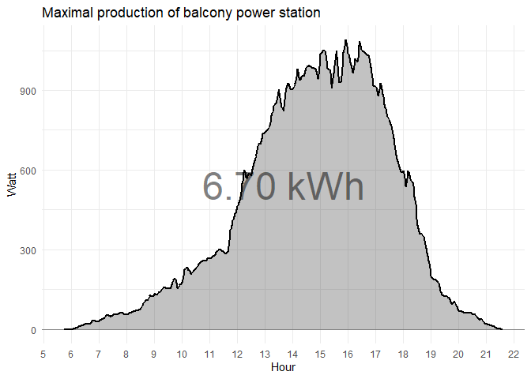

Net Electricity Consumption
================

Visualization of electricity production by balcony power station and net
electricity usage, measured by electricity meter.

by <a href="mailto:firstname.lastname@outlook.com">Konstantin</a> on
2025-08-10 22:23:14.354334

## Data prep

Import electricity net consumption from file

data/electricity_meter.csv.

Import electricity production on a daily level from files

- data/ps_daily/2025-07-08_2025-07-31.xlsx
- data/ps_daily/2025-08-01_2025-08-08.xlsx

Import electricity production on a detailed level from files

- data/ps_detail/2025-07-02_2025-07-31.xlsx
- data/ps_detail/2025-08-01_2025-08-08.xlsx

**Process** data

- create data with average electricity usage by date
- combine both data, electricity net usage and electricity production

## Evaluation

### Electricity meter

<!-- -->

### Daily electricity production

<!-- -->
