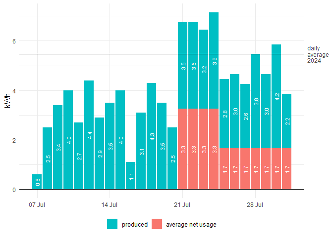

Net Electricity Consumption
================

Visualization of electricity production by balcony power station and net
electricity usage, measured by electricity meter.

<div>

by <a href="mailto:firstname.lastname@outlook.com">Konstantin</a> on
2025-07-31 21:50:21.230892

</div>

``` r
# load packages
library(conflicted)
library(dplyr)
library(ggplot2)
library(knitr)
library(readxl)
library(purrr)
library(tibble)
library(tidyr)

# solve package conflicts
# conflict_scout()
conflicts_prefer(dplyr::filter(), dplyr::lag(), .quiet = TRUE)

# set knitr options
opts_chunk$set(
  echo = FALSE,
  fig.path = file.path("img", .Platform$file.sep)
)
```

## Data prep

Import electricity net consumption from file

data/electricity_meter.csv.

Import electricity production from files

- data/20250731_power-station.xlsx

**Process** data

- create data with average electricity usage by date
- combine both data, electricity net usage and electricity production

## Evaluation

<!-- -->
