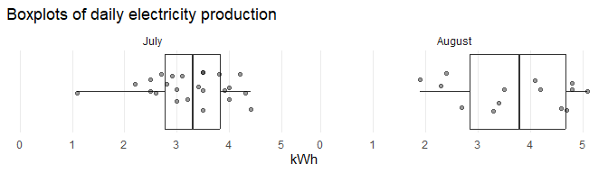

Net Electricity Consumption
================

Visualization of electricity produced by balcony power station and net
electricity usage measured by electricity meter.

<div>

by <a href="mailto:firstname.lastname@outlook.com">Konstantin</a> on
2025-08-14

</div>

<!-- Start of analysis -------------------------------------------------------->

<!-- -->

<!-- -->

<!-- -->

<!-- ```{r prod-details} -->

<!-- df_ps_detail_auc <-  -->

<!--   df_ps_detail_sum %>%  -->

<!--   nest(data = -name) %>%  -->

<!--   mutate(auc = map_dbl(data, .f = ~auc(.x$tm, .x$value))) %>%  -->

<!--   select(-data) -->

<!-- df_ps_detail_sum %>% -->

<!--   left_join(y = df_ps_detail_auc, by = join_by(name)) %>%  -->

<!--   mutate(aux = paste0(name, ": ", sprintf(fmt = "%.2f kWh", auc/1000)) %>% fct_inorder()) %>%  -->

<!--   ggplot(mapping = aes(x = tm, y = value, group = aux, color = aux)) +  -->

<!--   geom_hline(yintercept = 0, color = gray(.5)) +  -->

<!--   geom_line() +  -->

<!--   scale_x_continuous(breaks = 0:24, minor_breaks = NULL) +  -->

<!--   scale_y_continuous(expand = expansion(mult = c(0, .05))) +  -->

<!--   labs( -->

<!--     x = "Hour", -->

<!--     y = "Watt", -->

<!--     color = NULL, -->

<!--     title = "Quartiles of power station production", -->

<!--   ) +  -->

<!--   theme_minimal() -->

<!-- ``` -->

<!-- End of analysis ---------------------------------------------------------->
